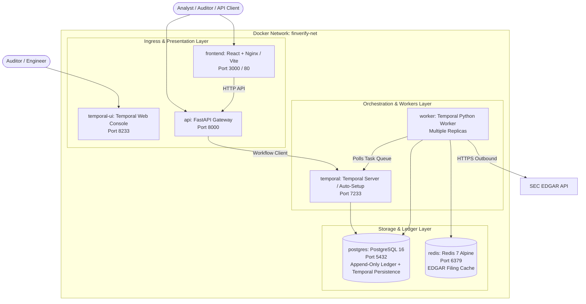

# Implementation Plan: FinVerify (Dockerized Architecture with Temporal)

FinVerify is a post-hoc, model-agnostic verification system that audits numerical claims produced by financial LLMs against SEC EDGAR ground truth using deterministic symbolic re-execution, issuing cryptographically signed (Ed25519) verification certificates.

This plan details the full implementation incorporating **Temporal** for workflow orchestration and a production-grade **Docker & Docker Compose containerization architecture** for one-command deployment of the full distributed stack.

---

## User Review Required

> [!IMPORTANT]
> **Containerized Topology with Temporal**:
> - **Zero-Setup Local & Production Runs**: The entire architecture (API, Temporal Server, Temporal Web UI, Temporal Worker, PostgreSQL Ledger, Redis Cache, and React Reviewer Dashboard) is orchestrated via Docker Compose.
> - **Self-Contained Dev & Prod Profiles**: Support for both live-reload local development (`docker compose --profile dev up`) and hardened production deployment (`docker compose --profile prod up`).
> - **Temporal Server Containerization**: Official `temporalio/auto-setup` container wired to PostgreSQL for persistent workflow execution history.

> [!IMPORTANT]
> **Deterministic Ground Rules (Non-Negotiable)**:
> 1. Symbolic Re-execution **never** invokes an LLM for calculation — only deterministic SymPy/NumPy DSL execution.
> 2. Discrepancy tolerances: $\le 0.2\%$ $\rightarrow$ `pass`, $0.2\% - 1.0\%$ $\rightarrow$ `pass_with_warning`, $> 1.0\%$ $\rightarrow$ `fail`.
> 3. Any unresolvable input or extraction failure routes to `unverifiable`, **never** `fail`.
> 4. Certificates and Reviewer decisions are stored in an append-only ledger (INSERT-only semantics).

---

## System Architecture & Docker Service Topology



---

## Docker Containerization Specifications

### Service Configuration Breakdown (`docker-compose.yml`)

| Service | Image / Base | Ports | Volumes & Persistence | Healthcheck / Dependencies |
| :--- | :--- | :--- | :--- | :--- |
| **`postgres`** | `postgres:16-alpine` | `5432:5432` | `pg_data:/var/lib/postgresql/data`, init SQL scripts | `pg_isready -U finverify` |
| **`redis`** | `redis:7-alpine` | `6379:6379` | `redis_data:/data` | `redis-cli ping` |
| **`temporal`** | `temporalio/auto-setup:latest` | `7233:7233` | Environment configs | Depends on `postgres` (healthy) |
| **`temporal-ui`**| `temporalio/ui:latest` | `8233:8233` | Environment configs | Depends on `temporal` |
| **`api`** | Multi-stage Python 3.11 (`Dockerfile.api`) | `8000:8000` | Code mount (dev) / static dist (prod) | Depends on `postgres`, `temporal` |
| **`worker`** | Multi-stage Python 3.11 (`Dockerfile.worker`)| N/A (Internal)| Cache & models volume | Depends on `temporal`, `postgres`, `redis` |
| **`frontend`** | Multi-stage Node 20 $\rightarrow$ Nginx (`Dockerfile.frontend`) | `3000:80` | Build cache | Depends on `api` |

---

## Proposed Changes

### Phase 1: Docker Infrastructure & Environment Setup

#### [NEW] [`Dockerfile.api`](file:///c:/Users/meetc/Projects/finverify/Dockerfile.api)
- Multi-stage build with Python 3.11-slim, non-root user, optimized layer caching for FastAPI + Pydantic + PyNaCl + SymPy + ReportLab.

#### [NEW] [`Dockerfile.worker`](file:///c:/Users/meetc/Projects/finverify/Dockerfile.worker)
- Python 3.11 worker container equipped with Temporal Python SDK, Outlines, SymPy, NumPy, and SEC EDGAR connectors.

#### [NEW] [`frontend/Dockerfile`](file:///c:/Users/meetc/Projects/finverify/frontend/Dockerfile)
- Multi-stage build: Stage 1 compiles React + Vite + TailwindCSS; Stage 2 serves assets using lightweight Nginx with reverse proxy to FastAPI.

#### [NEW] [`docker-compose.yml`](file:///c:/Users/meetc/Projects/finverify/docker-compose.yml)
- Full production and staging orchestration with health checks, resource limits, persistent volumes (`pg_data`, `redis_data`, `temporal_data`), and isolated network `finverify-net`.

#### [NEW] [`docker-compose.dev.yml`](file:///c:/Users/meetc/Projects/finverify/docker-compose.dev.yml)
- Developer override enabling hot reloading for FastAPI (`--reload`), React Vite dev server with HMR, and local debug logging.

#### [NEW] [`.env.example`](file:///c:/Users/meetc/Projects/finverify/.env.example) & [`.dockerignore`](file:///c:/Users/meetc/Projects/finverify/.dockerignore)
- Configuration template for PostgreSQL credentials, Temporal endpoints, SEC EDGAR User-Agent headers, Ed25519 signing keys, and JWT secrets.

---

### Phase 2: Core Data Models & Append-Only Database Schema

#### [NEW] [`src/db/models.py`](file:///c:/Users/meetc/Projects/finverify/src/db/models.py)
- **`Report`**: `report_id` (UUID PK), `submitted_at`, `llm_model`, `filing_cik`, `filing_period`, `form_type`, `status` (`pass|partial|fail|unverifiable`), `summary_cert_json` (JSONB), `summary_signature` (BYTEA).
- **`Claim`**: `claim_id` (UUID PK), `report_id` (FK), `claim_text`, `claim_type` (`computable|non-computable`), `inputs_json` (JSONB), `output_value` (NUMERIC), `unit`, `source_refs_json` (JSONB).
- **`Certificate`**: `cert_id` (UUID PK), `claim_id` (FK), `issued_at`, `status` (`pass|fail|pass_with_warning|unverifiable`), `expected_value`, `computed_value`, `relative_error`, `discrepancy_trace` (JSONB), `cert_payload_json` (JSONB), `signature` (BYTEA), `qr_code_url`.
- **`ReviewerDecision`**: `decision_id` (UUID PK), `cert_id` (FK), `reviewer_id`, `decision` (`accepted|rejected|annotated`), `annotation`, `decided_at`, `decision_signature` (BYTEA).

#### [NEW] [`src/db/init.sql`](file:///c:/Users/meetc/Projects/finverify/src/db/init.sql)
- Database initialization script executed automatically inside the PostgreSQL container on startup, establishing tables, indexes, and SQL trigger rules enforcing `INSERT`-only permissions on `certificates` and `reviewer_decisions`.

---

### Phase 3: Deterministic Symbolic Re-Executor Engine

#### [NEW] [`src/reexecutor/engine.py`](file:///c:/Users/meetc/Projects/finverify/src/reexecutor/engine.py)
- Domain Specific Language (DSL) covering:
  - Arithmetic operations: addition, subtraction, multiplication, division, percentage growth.
  - Financial ratios: `gross_margin`, `operating_margin`, `net_margin`, `basic_eps`, `diluted_eps`, `pe_ratio`, `debt_to_equity`, `current_ratio`, `interest_coverage`, `yoy_change`, `qoq_change`, `cagr`, `segment_sum`, `weighted_average`.
- SymPy / NumPy computation with exact precision arithmetic.
- Verification logic:
  $$\text{relative\_error} = \frac{|\text{expected} - \text{computed}|}{|\text{computed}|}$$
  - $\le 0.002 \rightarrow \text{pass}$
  - $0.002 - 0.01 \rightarrow \text{pass\_with\_warning}$
  - $> 0.01 \rightarrow \text{fail}$
  - Unresolved input / unsupported operation $\rightarrow \text{unverifiable}$ (never `fail`).
- Detailed `discrepancy_trace` generation recording intermediate step formulas and source references.

---

### Phase 4: Cryptographic Signing & Canonical Certificate Generation

#### [NEW] [`src/crypto/signer.py`](file:///c:/Users/meetc/Projects/finverify/src/crypto/signer.py)
- Ed25519 (RFC 8032) keypair generation and signing using PyNaCl.
- Canonical JSON serialization (sorted keys, no whitespace: `separators=(',', ':')`, UTF-8).
- Standalone verification helper for third parties using public key with zero backend dependencies.
- QR code payload generator linking to `qr_code_url`.

---

### Phase 5: SEC EDGAR Source Linker & Filing Ingestion

#### [NEW] [`src/ingestion/edgar_client.py`](file:///c:/Users/meetc/Projects/finverify/src/ingestion/edgar_client.py)
- SEC EDGAR Company Facts API integration with automated 10 req/s rate-limiting token bucket.
- Redis caching for company facts and filing data.
- Standard XBRL taxonomy lookup (`us-gaap:*`) across annual and quarterly frames.
- Semantic search fallback (ChromaDB / FAISS) for tabular MD&A numbers.

---

### Phase 6: Multi-Format Document Ingestion & Claim Extraction

#### [NEW] [`src/parsers/document_parser.py`](file:///c:/Users/meetc/Projects/finverify/src/parsers/document_parser.py)
- Ingestion parsers for `text`, `json`, `pdf` (with OCR fallback), `docx`, and `csv`.
- 100,000 extracted character ceiling check and CIK/period format validation.

#### [NEW] [`src/extractor/claim_extractor.py`](file:///c:/Users/meetc/Projects/finverify/src/extractor/claim_extractor.py)
- Grammar-constrained extraction into structured claim schemas.

---

### Phase 7: Temporal Workflows & Activities

#### [NEW] [`src/workflows/verify_workflow.py`](file:///c:/Users/meetc/Projects/finverify/src/workflows/verify_workflow.py)
- `VerifyReportWorkflow` coordinates:
  1. `parse_input_activity`
  2. `extract_claims_activity`
  3. Parallel execution of `link_edgar_source_activity`, `symbolic_reexecute_activity`, and `sign_certificate_activity`
  4. Aggregation into Report-Level Summary Certificate
  5. Human review signal handling (`ReviewerDecisionSignal`) for unverifiable claims
  6. Webhook callback execution

#### [NEW] [`src/workflows/activities.py`](file:///c:/Users/meetc/Projects/finverify/src/workflows/activities.py)
- Activity definitions with retry policies, timeouts, and heartbeats.

#### [NEW] [`src/workflows/worker.py`](file:///c:/Users/meetc/Projects/finverify/src/workflows/worker.py)
- Containerized Temporal Worker entrypoint listening on `finverify-task-queue`.

---

### Phase 8: FastAPI Backend & API Contracts

#### [NEW] [`src/api/main.py`](file:///c:/Users/meetc/Projects/finverify/src/api/main.py) & [`src/api/routes.py`](file:///c:/Users/meetc/Projects/finverify/src/api/routes.py)
- `POST /api/v1/verify`: Initiates verification workflow, returns `job_id`.
- `POST /api/v1/review/{cert_id}`: Submits human review decision and signals workflow.
- `GET /api/v1/jobs/{job_id}`: Retrieves job status and progress.
- `GET /api/v1/reports/{report_id}`: Retrieves report certificate + claim certificates.
- `GET /api/v1/certificates/{cert_id}`: Retrieves single signed certificate.
- `GET /api/v1/ledger`: Filterable, paginated audit ledger.
- `GET /api/v1/certificates/{cert_id}/pdf`: Generates PDF certificate with embedded QR code.

---

### Phase 9: PDF Certificate Rendering with QR Code

#### [NEW] [`src/reports/pdf_generator.py`](file:///c:/Users/meetc/Projects/finverify/src/reports/pdf_generator.py)
- `ReportLab` PDF generator producing audit-ready reports with status badges, discrepancy trace tables, and verifiable QR codes.

---

### Phase 10: Reviewer Dashboard (Frontend)

#### [NEW] [`frontend/`](file:///c:/Users/meetc/Projects/finverify/frontend/)
- React + TailwindCSS SPA with:
  - **Claim Review Queue**: Filter by status (`unverifiable`, `pass_with_warning`).
  - **Discrepancy Trace Visualizer**: Step-by-step math comparison against EDGAR source.
  - **Decision Form**: Accept / reject with mandatory annotations.
  - **Tamper Verifier**: In-browser client-side Ed25519 signature validator.

---

## Verification Plan

### Automated Containerized Tests
- Run test suite inside isolated Docker test container:
  ```bash
  docker compose run --rm api pytest tests/ -v
  ```
- **Deterministic Re-executor Tests** (`tests/test_reexecutor.py`): Test all financial DSL formulas against exact relative-error boundaries.
- **Crypto & Tamper-evidence Tests** (`tests/test_crypto.py`): Verify Ed25519 signing and tamper detection.
- **EDGAR Ingestion & Caching Tests** (`tests/test_edgar.py`): Rate-limiting and XBRL mapping validation.
- **Temporal Workflow Integration Tests** (`tests/test_workflows.py`): Durable execution and signal listener verification.
- **Synthetic Error-Injection Benchmark** (`tests/test_finqa_benchmark.py`): FinQA test set verification demonstrating $\ge 90\%$ catch rate and $\le 5\%$ false-flag rate.

### Manual Verification via Docker
1. Start the complete system:
   ```bash
   docker compose up --build -d
   ```
2. Verify all containers are healthy:
   - Check `http://localhost:8000/docs` (FastAPI Swagger UI).
   - Check `http://localhost:8233` (Temporal Web Console).
   - Check `http://localhost:3000` (Reviewer Dashboard).
3. Submit a multi-format payload via `POST /api/v1/verify`.
4. Observe the workflow run in Temporal UI.
5. Review generated certificate in the React dashboard and download the signed PDF with QR code.
